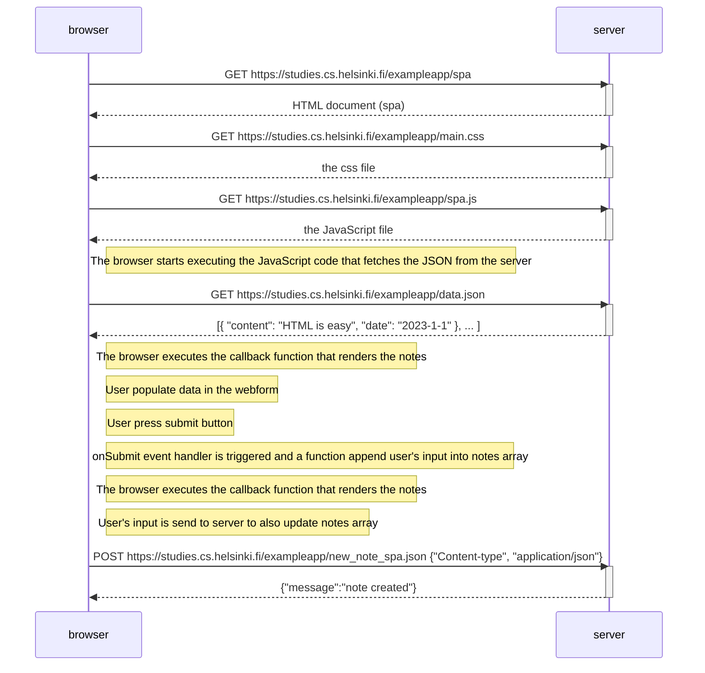

```mermaid
sequenceDiagram
    participant browser
    participant server

    browser->>server: GET https://studies.cs.helsinki.fi/exampleapp/spa
    activate server
    server-->>browser: HTML document (spa)
    deactivate server

    browser->>server: GET https://studies.cs.helsinki.fi/exampleapp/main.css
    activate server
    server-->>browser: the css file
    deactivate server

    browser->>server: GET https://studies.cs.helsinki.fi/exampleapp/spa.js
    activate server
    server-->>browser: the JavaScript file
    deactivate server

    Note right of browser: The browser starts executing the JavaScript code that fetches the JSON from the server

    browser->>server: GET https://studies.cs.helsinki.fi/exampleapp/data.json
    activate server
    server-->>browser: [{ "content": "HTML is easy", "date": "2023-1-1" }, ... ]
    deactivate server

    Note right of browser: The browser executes the callback function that renders the notes
    Note right of browser: User populate data in the webform
    Note right of browser: User press submit button
    Note right of browser: onSubmit event handler is triggered and a function append user's input into notes array
    Note right of browser: The browser executes the callback function that renders the notes
    Note right of browser: User's input is send to server to also update notes array

    browser->>server: POST https://studies.cs.helsinki.fi/exampleapp/new_note_spa.json {"Content-type", "application/json"}
    activate server
    server-->>browser: {"message":"note created"}
    deactivate server


```
